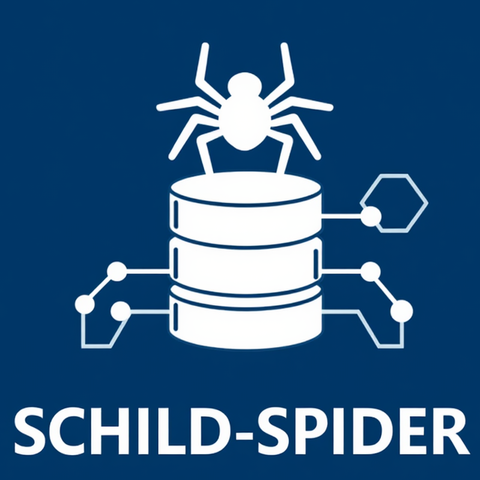

<p align="center">
  
</p>

# Schild Spider

Desktop-Tool zur automatisierten Synchronisation von Schülerdaten zwischen **SchILD NRW** und angebundenen Zielsystemen.

```
┌──────────────┐    ┌──────────┐    ┌──────────────┐
│   ADAPTER    │───>│   CORE   │───>│   PLUGINS    │
│   (Input)    │    │ (Engine) │    │  (Output)    │
└──────────────┘    └──────────┘    └──────────────┘
 SchILD CSV/DB       Diff-Engine     Hagen-ID API
                     ChangeSet       M365 Graph
                     Failsafes       Moodle (geplant)
```

## Features

- **Hub-and-Spoke-Architektur** — Adapter lesen, Plugins schreiben, die Core-Engine berechnet den Diff
- **Dry-Run-Prinzip** — Änderungen werden berechnet und in einer Vorschau angezeigt, bevor sie angewendet werden
- **Failsafe-Schutz** — Blockiert automatisch bei >15% Deaktivierungen (Schutz vor unvollständigen Datenexporten)
- **Plugin-System** — Jedes Plugin beschreibt sich selbst (Config-Felder, Verbindungstest), die GUI rendert dynamisch
- **Adapter-System** — Verschiedene Datenquellen (CSV-Export, DB-Zugriff) über einheitliche Schnittstelle

## Unterstützte Systeme

| Typ | System | Status |
|-----|--------|--------|
| Adapter | SchILD CSV-Export | Verfügbar |
| Adapter | SchILD DB (MariaDB/ODBC) | Geplant |
| Plugin | Hagen-ID (Schülerausweise) | Verfügbar |
| Plugin | Microsoft 365 (Graph API) | Geplant |
| Plugin | Moodle | Geplant |
| Plugin | Untis | Geplant |

## Schnellstart

### Voraussetzungen

- Python 3.12+
- Abhängigkeiten: `PySide6`, `requests`, `Pillow`

### Installation (Entwicklung)

```bash
git clone https://github.com/beiti/schild-spider.git
cd schild-spider
python -m venv .venv
.venv/Scripts/activate        # Windows
# source .venv/bin/activate   # macOS/Linux
pip install -r requirements.txt
```

### Konfiguration

```bash
cp settings.example.json settings.json
```

Einstellungen direkt in der App unter **"Einstellungen..."** konfigurieren:
1. Datenquelle wählen und Pfade setzen
2. Plugins aktivieren und API-Keys eintragen
3. Verbindung testen

### Starten

```bash
python main.py
```

### Windows .exe

Die vorkompilierte `.exe` ist auf der [Releases-Seite](https://github.com/beiti/schild-spider/releases) verfügbar. Wird automatisch per GitHub Actions bei jedem Tag gebaut.

## Projektstruktur

```
schild-spider/
├── main.py                  # Einstiegspunkt
├── requirements.txt
├── settings.example.json    # Vorlage für settings.json
│
├── core/
│   ├── models.py            # StudentRecord, ChangeSet, ConfigField
│   ├── engine.py            # Diff-Logik + Failsafe
│   └── plugin_loader.py     # Adapter- und Plugin-Registry
│
├── adapters/
│   ├── base.py              # AdapterBase (ABC)
│   └── schild_csv.py        # CSV-Import
│
├── plugins/
│   ├── base.py              # PluginBase (ABC)
│   └── hagen_id.py          # Hagen-ID REST API
│
├── gui/
│   ├── mainwindow.py        # Hauptfenster (3-Phasen-Workflow)
│   └── settings_dialog.py   # Einstellungen + Plugin-Manager
│
├── documentation/
│   └── howto.md              # Benutzerhandbuch
│
└── .github/workflows/
    └── build-exe.yml         # CI: PyInstaller Build
```

## Eigenes Plugin / Adapter entwickeln

### Plugin

1. Neue Datei in `plugins/` erstellen
2. Von `PluginBase` erben und alle Methoden implementieren:
   - `plugin_name()`, `config_schema()`, `from_config()`, `test_connection()`
   - `get_manifest()`, `compute_data_hash()`, `apply_new()`, `apply_changes()`, `apply_suspend()`
3. In `core/plugin_loader.py` → `_PLUGIN_REGISTRY` eintragen

### Adapter

1. Neue Datei in `adapters/` erstellen
2. Von `AdapterBase` erben:
   - `adapter_name()`, `config_schema()`, `from_config()`
   - `load() -> list[StudentRecord]`
3. In `core/plugin_loader.py` → `_ADAPTER_REGISTRY` eintragen

Die GUI zeigt neue Adapter und Plugins automatisch mit den richtigen Eingabefeldern an.

## Lizenz

[GPL v3](LICENSE)

Abhängigkeiten unterliegen ihren eigenen Lizenzen (PySide6: LGPL v3, requests: Apache 2.0, Pillow: HPND).
