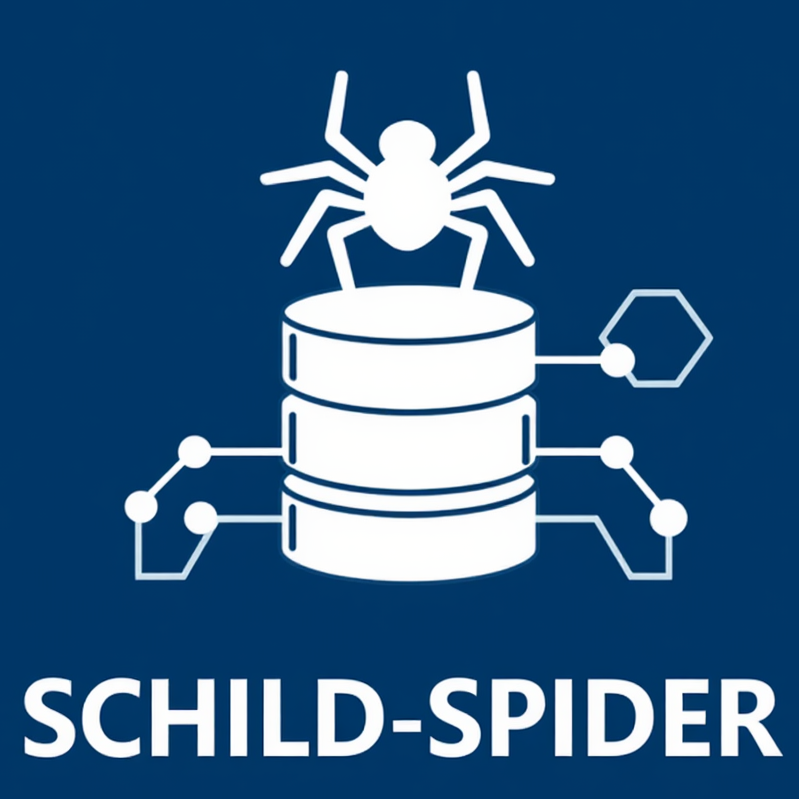

<p align="center">
  
</p>

# Schild Spider

Desktop-Tool zur automatisierten Synchronisation von Schülerdaten zwischen **SchILD NRW 2** und angebundenen Zielsystemen.

> **Public Beta** — Dieses Projekt befindet sich in aktiver Entwicklung. Funktionen können unvollständig sein oder sich ändern. Nutzung auf eigene Verantwortung. Feedback, Fehlerberichte und Feature-Wünsche sind willkommen — einfach ein [Issue](https://github.com/beitist/schild-spider/issues) erstellen oder melden!
>
> **Kompatibilität:** Entwickelt und getestet mit **SchILD 2** (MariaDB/MySQL). SchILD 3 ist bisher nicht getestet — Unterstützung ist möglich, aber nicht garantiert.

```
┌──────────────┐    ┌──────────┐    ┌──────────────┐
│   ADAPTER    │───>│   CORE   │───>│   PLUGINS    │
│   (Input)    │    │ (Engine) │    │  (Output)    │
└──────────────┘    └──────────┘    └──────────────┘
 SchILD CSV/DB       Diff-Engine     Hagen-ID API
                     ChangeSet       M365 Graph
                     Failsafes       Moodle REST API
```

## Features

- **Hub-and-Spoke-Architektur** — Adapter lesen, Plugins schreiben, die Core-Engine berechnet den Diff
- **Dry-Run-Prinzip** — Änderungen werden berechnet und in einer Vorschau angezeigt, bevor sie angewendet werden
- **Failsafe-Schutz** — Bei >15% Deaktivierungen ist eine explizite Bestätigung nötig, bei >50% eine doppelte (Schutz vor unvollständigen Datenexporten)
- **Plugin-System** — Jedes Plugin beschreibt sich selbst (Config-Felder, Verbindungstest), die GUI rendert dynamisch
- **Adapter-System** — Verschiedene Datenquellen (CSV-Export, DB-Zugriff) über einheitliche Schnittstelle
- **Änderungsvorschau mit Details** — Generierte Email-Adressen und konkrete Unterschiede (Email alt → neu, Klasse alt → neu, Name) werden vor dem Anwenden angezeigt
- **Klassengruppen** — Automatische Erstellung von SuS- und KuK-Gruppen pro Klasse (M365), Kurs-Sync (Moodle)
- **Write-Back** — Generierte Email-Adressen werden nach dem Anwenden direkt zum Rückschreiben in die SchILD-DB angeboten (oder automatisch, per Plugin-Option); danach werden die Quelldaten automatisch neu geladen
- **Email-Korrektur nach Klassenwechsel** — Beim Laden werden SchILD-Emails gegen das Template geprüft (z.B. `{k}.{n}`); veraltete Adressen können per Dialog in SchILD aktualisiert werden, der M365-Sync zieht den UPN danach nach
- **Email-Fallback-Matching** — Bestehende M365-Accounts werden per Email erkannt, auch ohne employeeId
- **Crash-Diagnostik** — Worker-Logging in `spider.log`, nativer Crash-Traceback via `faulthandler`

## Unterstützte Systeme

| Typ | System | Status |
|-----|--------|--------|
| Adapter | SchILD CSV-Export | Verfügbar |
| Adapter | SchILD DB (MariaDB/MySQL) | Verfügbar (inkl. Kurse/Fächer) |
| Plugin | Hagen-ID (Schülerausweise) | Verfügbar |
| Plugin | Hagen-ID (Lehrerausweise) | Verfügbar (nur DB-Adapter) |
| Plugin | Microsoft 365 (Graph API) | Verfügbar |
| Plugin | Moodle (REST API, SSO via OIDC) | Verfügbar |
| Plugin | Untis | Geplant |

## Schnellstart

### Voraussetzungen

- Python 3.12+
- Abhängigkeiten: `PySide6`, `requests`, `PyMySQL` (optional: `pyodbc` für MS SQL)

### Installation (Entwicklung)

```bash
git clone https://github.com/beitist/schild-spider.git
cd schild-spider
python -m venv .venv
.venv/Scripts/activate        # Windows
# source .venv/bin/activate   # macOS/Linux
pip install -r requirements.txt
```

### Konfiguration

Beim **ersten Start** öffnet sich ein Einrichtungs-Assistent:
1. Schulname eingeben
2. Datenquelle (Adapter) wählen
3. Gewünschte Zielsysteme (Plugins) aktivieren

Anschließend unter **„Einstellungen..."** die Pfade und API-Keys eintragen und die Verbindung testen.

> Bei Updates wird die `settings.json` automatisch migriert — bestehende Einstellungen bleiben erhalten.

### Starten

```bash
python main.py
```

### Windows .exe

Die vorkompilierte `.exe` ist auf der [Releases-Seite](https://github.com/beitist/schild-spider/releases) verfügbar. Wird automatisch per GitHub Actions bei jedem Tag gebaut.

## Projektstruktur

```
schild-spider/
├── main.py                  # Einstiegspunkt + Splash + Setup-Wizard
├── requirements.txt
│
├── core/
│   ├── models.py            # StudentRecord, ChangeSet, ConfigField
│   ├── engine.py            # Diff-Logik + Failsafe + Email-Fallback
│   ├── email_generator.py   # Email-Erzeugung mit Transliteration
│   ├── graph_client.py      # Microsoft Graph REST API Client
│   ├── moodle_client.py     # Moodle Web Services REST API Client
│   ├── paths.py             # Asset-Pfade (PyInstaller-kompatibel)
│   └── plugin_loader.py     # Registry, Settings-Versionierung, Migration
│
├── adapters/
│   ├── base.py              # AdapterBase (ABC)
│   ├── schild_csv.py        # CSV-Import
│   └── schild_db.py         # MariaDB-Direktzugriff (pymysql)
│
├── plugins/
│   ├── base.py              # PluginBase (ABC)
│   ├── hagen_id.py          # Hagen-ID REST API (Schüler)
│   ├── hagen_id_lehrer.py   # Hagen-ID REST API (Lehrkräfte)
│   ├── m365.py              # Microsoft 365 / Entra ID (Graph API)
│   └── moodle.py            # Moodle (Web Services REST API)
│
├── gui/
│   ├── mainwindow.py        # Hauptfenster (3-Phasen-Workflow)
│   ├── settings_dialog.py   # Einstellungen + Plugin-Manager
│   ├── setup_wizard.py      # Erststart-Assistent
│   └── workers.py           # Hintergrund-Worker (Load, Compute, Apply)
│
├── documentation/
│   └── howto.md              # Benutzerhandbuch
│
└── .github/workflows/
    ├── build-exe.yml         # CI: PyInstaller Build → GitHub Release
    └── quality.yml           # CI: Ruff Lint + Format
```

## Microsoft 365 / Entra ID einrichten

Das M365-Plugin nutzt die **Microsoft Graph REST API** mit Application Permissions (Client Credentials Flow). Folgende Einrichtung ist einmalig im Azure-Portal nötig:

### 1. App Registration erstellen

1. [Azure Portal](https://portal.azure.com) → **Microsoft Entra ID** → **App-Registrierungen** → **Neue Registrierung**
2. Name: z.B. `Schild Spider`
3. **Unterstützte Kontotypen**: **Nur dieses Organisationsverzeichnis**
4. **Umleitungs-URI**: leer lassen
5. **Registrieren** klicken

### 2. Client Secret erzeugen

1. In der neuen App → **Zertifikate und geheime Schlüssel** → **Neuer geheimer Clientschlüssel**
2. Beschreibung und Gültigkeit wählen → **Hinzufügen**
3. **Wert** sofort kopieren (wird nur einmal angezeigt!)

### 3. API-Berechtigungen setzen

Unter **API-Berechtigungen** → **Eine Berechtigung hinzufügen** → **Microsoft Graph** → **Anwendungsberechtigungen**:

| Permission | Wofür |
|---|---|
| `User.ReadWrite.All` | Schüler-Accounts anlegen, ändern, deaktivieren |
| `Directory.ReadWrite.All` | Gruppen + Lizenzen verwalten |
| `GroupMember.ReadWrite.All` | Gruppen-Mitgliedschaften pflegen |

Danach **Zustimmung des Administrators erteilen** klicken (erfordert Global Admin / Privileged Role Admin).

### 4. IDs notieren

Aus der App-Übersicht (**Overview**) benötigst du:
- **Anwendungs- (Client) ID**
- **Verzeichnis- (Mandant) ID**
- Den zuvor kopierten **geheimen Clientschlüssel**

Diese drei Werte trägst du in Schild Spider unter **Einstellungen → Microsoft 365** ein.

### 5. Optionale SKU-ID für Lizenz-Zuweisung

Falls Schüler automatisch eine Lizenz erhalten sollen (z.B. A1 for Students), benötigst du die **SKU-ID**. Diese findest du über:
- Azure Portal → **Licenses** → **All products** → Produkt anklicken → Properties → **Object ID**
- Oder per Graph API: `GET /subscribedSkus`

Lässt du das Feld leer, erfolgt keine automatische Lizenzzuweisung.

### 6. Verhalten bei Email-Änderung (z.B. Klassenwechsel)

Ändert sich die SchILD-Email eines Schülers (etwa weil die Klasse Teil der Adresse ist), bietet **Einstellungen → Microsoft 365 → „Bei Email-Änderung"** zwei Wege:

| Option | Verhalten |
|---|---|
| **Adresse ändern** (Standard) | UPN und mailNickname werden am bestehenden Konto umbenannt — Postfach, OneDrive und Gruppen bleiben. Zusätzlich wird versucht, die primäre Mailadresse (`mail`) nachzuziehen; lehnt Exchange das ab, erscheint eine Warnung mit alt → neu zum manuellen Nachziehen. |
| **Neues Konto anlegen, altes deaktivieren** | Neues Konto mit der neuen Adresse (inkl. Lizenz), danach wird das alte Konto deaktiviert, seine employeeId entfernt und der Anzeigename mit „(alt)" markiert. |

### 7. Weitere Optionen

| Option | Wirkung |
|---|---|
| **Generierte Emails automatisch nach SchILD zurückschreiben** | Nach dem Anwenden wird ohne Rückfrage zurückgeschrieben. Standard: aus — dann fragt der Abschluss-Dialog nach; bei „Nein" bleibt der Button „Rückschreiben" sichtbar. |
| **Klassengruppen (SuS) synchronisieren** | Gruppen pro Klasse (SuS + Klassenleitung) berechnen und pflegen. Abschaltbar, z.B. solange die Lehrerdaten in SchILD unvollständig sind. |
| **Lehrergruppen (KuK) synchronisieren** | Gruppen mit allen Lehrkräften einer Klasse (aus Leistungsdaten + Klassenleitung). Ebenfalls abschaltbar. |

Die Email-Änderung selbst wird in SchILD vorbereitet: Beim Laden der Quelldaten erkennt Schild Spider Adressen, die nicht mehr zum Template passen, und bietet sie über **„Email-Adressen aktualisieren"** zum Rückschreiben an. Danach **Berechnen → Anwenden** im M365-Plugin.

---

## Hagen-ID: Lehrerausweise

Das Plugin **Hagen-ID (Lehrkräfte)** nutzt dieselbe API und denselben API-Key wie der Schüler-Sync, arbeitet aber auf einer eigenen Teilmenge: Lehrkräfte liegen im Ausweis-System als Datensätze der Pseudo-Klasse `Lehrerkollegium`. Beide Plugins filtern darauf — das Schüler-Plugin schließt sie aus, das Lehrer-Plugin sieht nur sie. Deshalb deaktiviert keins der beiden die Datensätze des anderen.

- **Quelle:** ausschließlich der **DB-Adapter**. Die Lehrer-CSV enthält keine SchILD-ID, und ohne stabile ID gibt es keinen kollisionsfreien Namespace. Lehrkräfte ohne ID werden übersprungen und im Log gemeldet.
- **IDs:** `L-<k_lehrer.ID>`, z.B. `L-4711` — kollidiert nie mit einer Schüler-ID.
- **Wer kommt rein:** `k_lehrer.Statistik = '+'`, optional zusätzlich gefiltert über das Adapter-Feld **Lehrer: PersonTyp-Filter** (leer = alle, sonst z.B. `LEHRKRAFT`).
- **Fotos (optional):** Ordner mit `KUERZEL.jpg` / `.png`. Ein Foto wird **nur beim Erst-Sync** gesetzt — sobald im Zielsystem eines liegt, rührt das Plugin es nicht mehr an. So überschreibt der Sync keinen Selbst-Upload der Lehrkraft.
- **Sicherheits-Riegel:** Bei 0 Lehrkräften aus SchILD werden gar keine Abmeldungen ausgeführt. Darüber hinaus bricht der Sync ab, wenn mehr als `max(3, 30%)` der Konten abgemeldet werden sollen — bei einem kleinen Kollegium greift eine reine Prozent-Schwelle zu spät. Die Vorschau warnt bereits vorher; einzelne Abmeldungen lassen sich dort abwählen.

---

## Moodle einrichten

Das Moodle-Plugin legt Schüler-Accounts an (`auth=oidc` für SSO), erstellt Kategorien und Kurse pro Klasse/Fach/Lehrer und schreibt Schüler sowie Lehrer in die richtigen Kurse ein.

### 1. Web Service aktivieren

1. **Website-Administration** → **Server** → **Web-Services** → **Übersicht**
2. **Web Services aktivieren** einschalten
3. **REST-Protokoll** aktivieren

### 2. Externen Service erstellen

1. **Website-Administration** → **Server** → **Web-Services** → **Externe Services**
2. **Hinzufügen** → Name: z.B. `Schild Spider`
3. Folgende **Funktionen** hinzufügen:

| Funktion | Wofür |
|---|---|
| `core_user_get_users` | Schüler/Lehrer suchen |
| `core_user_get_users_by_field` | Schüler per idnumber suchen |
| `core_user_create_users` | Schüler-Accounts anlegen |
| `core_user_update_users` | Accounts aktualisieren/deaktivieren |
| `core_course_get_categories` | Kategorien auflisten |
| `core_course_create_categories` | Kategorien pro Klasse anlegen |
| `core_course_get_courses_by_field` | Kurse per idnumber suchen |
| `core_course_create_courses` | Kurse anlegen |
| `enrol_manual_enrol_users` | Schüler/Lehrer in Kurse einschreiben |
| `enrol_manual_unenrol_users` | Aus Kursen abmelden |
| `core_enrol_get_enrolled_users` | Eingeschriebene User pro Kurs auflisten |
| `core_webservice_get_site_info` | Verbindungstest |

### 3. Token erzeugen

1. **Website-Administration** → **Server** → **Web-Services** → **Token verwalten**
2. **Token erstellen** → Service: `Schild Spider` → Admin-User auswählen
3. Token kopieren

### 4. In Schild Spider eintragen

Unter **Einstellungen → Moodle**:
- **Moodle URL** — z.B. `https://moodle.schule.de`
- **Web Service Token** — der eben kopierte Token
- **Eltern-Kategorie-ID** — `0` für Top-Level, oder die ID einer bestehenden Kategorie
- **Kurs-Templates** — `{k}` = Klasse, `{f}` = Fach, `{l}` = Lehrer

> **Voraussetzung:** Schüler benötigen eine Email-Adresse (z.B. nach M365-Sync + Write-Back). Schüler ohne Email werden übersprungen.

---

## Eigenes Plugin / Adapter entwickeln

### Plugin

1. Neue Datei in `plugins/` erstellen
2. Von `PluginBase` erben und alle Methoden implementieren:
   - `plugin_name()`, `config_schema()`, `from_config()`, `test_connection()`
   - `get_manifest()`, `compute_data_hash()`, `apply_new()`, `apply_changes()`, `apply_suspend()`
   - Optional: `enrich_preview()` — Vorschau-Daten anreichern (z.B. Emails vorgenerieren)
3. In `core/plugin_loader.py` → `_PLUGIN_REGISTRY` eintragen

### Adapter

1. Neue Datei in `adapters/` erstellen
2. Von `AdapterBase` erben:
   - `adapter_name()`, `config_schema()`, `from_config()`
   - `load() -> list[StudentRecord]`
   - Optional: `load_teachers()`, `supports_write_back()`, `write_back()`
3. In `core/plugin_loader.py` → `_ADAPTER_REGISTRY` eintragen

Die GUI zeigt neue Adapter und Plugins automatisch mit den richtigen Eingabefeldern an.

### Windows EXE bauen

Neue Adapter/Plugins werden automatisch in die EXE eingebundelt (`--collect-submodules` in der Build-Config). Einfach einen neuen Git-Tag pushen — GitHub Actions baut die EXE und erstellt ein Release:

```bash
git tag v1.0
git push origin main --tags
```

## Lizenz

[GPL v3](LICENSE)

Abhängigkeiten unterliegen ihren eigenen Lizenzen (PySide6: LGPL v3, requests: Apache 2.0, PyMySQL: MIT).
